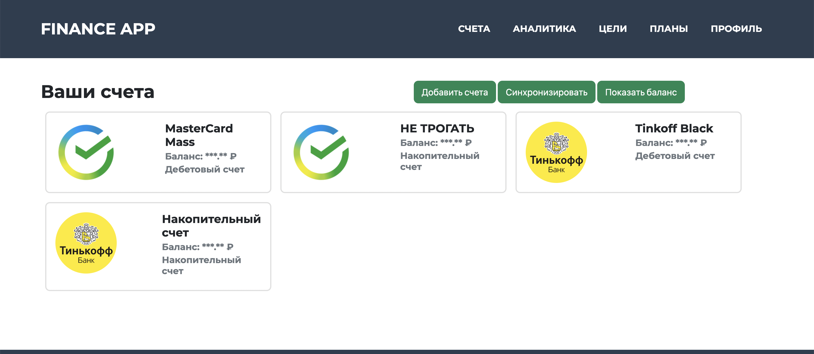

# Self-Hosted Finance App

> Приложение, которое имитируя банковские приложения, получает список транзакций и счетов пользователя, затем позволяет проанализировать их.

## Функционал
 - Получение списка транзакций и счетов пользователя
 - Анализ транзакций и счетов пользователя (Создание отчета)
 - Создание плана на следующий месяц
 - Ведение финансовых целей

## Требования
- PostgreSQL
- Java

## Скриношоты

## To-Do
- [ ] Разделить на фронт и бэк, мобильное приложение исходя из этого
- [ ] DockerCompose
- [ ] Добавить больше банков
- [ ] Сравнение отчета с планом